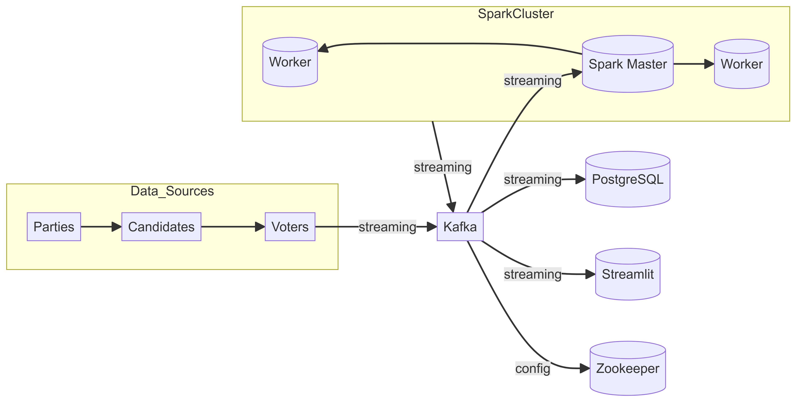

# Realtime Election Data Project

## Overview

This is a side project focused on working with modern big data technologies to build a real-time election end-to-end system. The aim is to broaden knowledge in data engineering by using technologies like Apache Kafka and Apache Spark.

## Table of Contents
- [Overview](#overview)
- [Features](#features)
- [Technologies Used](#technologies-used)
- [Prerequisites](#prerequisites)
- [Installation](#installation)
- [Usage](#usage)
- [Acknowledgements](#acknowledgements)

## Features
- Real-time data streaming with Apache Kafka.
- Data processing and analysis using Apache Spark.
- Dockerized deployment for easy setup and scaling.
- Python-based application with PostgreSQL integration.
- Real-time data visualization with Streamlit.

## Technologies Used
- **Apache Kafka**: For real-time data streaming.
- **Apache Spark**: For data processing and analysis.
- **Docker**: For containerization.
- **PostgreSQL**: As the database.
- **Python**: The main programming language used.

## Architecture 



## Prerequisites

- **Java Development Kit (JDK)**: Ensure you have Java 8 or later installed, which is required for PySpark.
- **Python**: Make sure Python 3.9 or later is installed.
- **Docker**: Docker and Docker Compose need to be installed on your machine.

  ## Components

- **main.py**: This script creates the required tables in PostgreSQL (candidates, voters, and votes), sets up the Kafka topic, and creates a copy of the votes table in the Kafka topic. It also includes logic to consume votes from the Kafka topic and produce data to `voters_topic` on Kafka.
- **voting.py**: This script contains the logic to consume votes from the `voters_topic` on Kafka, generate voting data, and produce data to `votes_topic` on Kafka.
- **spark-streaming.py**: This script consumes votes from the `votes_topic` on Kafka, enriches the data with information from PostgreSQL, aggregates the votes, and produces the aggregated data to specific topics on Kafka.
- **streamlit-app.py**: This script consumes the aggregated voting data from the Kafka topic and PostgreSQL and displays the voting data in real-time using Streamlit.

## Installation

1. Clone the repository:
    ```bash
    git clone https://github.com/sallahda/realtime-election-data-project.git
    cd realtime-election-data-project
    ```

2. Set up the environment:
    ```bash
    python3 -m venv venv
    source venv/bin/activate
    ```

3. Install the dependencies:
    ```bash
    pip install -r requirements.txt
    ```

4. Build and run the Docker containers:
    ```bash
    docker-compose up --build
    ```

## Usage

1. Ensure all services are running:
    ```bash
    docker-compose ps
    ```

2. Run the application to create the database, tables, and generate mock data:
    ```bash
    python app.py
    ```

3. In different terminals, run the following commands simultaneously, the voting system will start streaming votes with Kafka to a topic, Spark will consume this data, store and process it for the dashboard:
    ```bash
    python voting-system.py
    python spark-streaming.py
    ```

4. To visualize all the processed data in real-time, run:
    ```bash
    streamlit run streamlit-dashboard.py
    ```

## Acknowledgements

Thanks to Yusuf Ganiyu for the knowledge shared through his tutorial.
https://www.youtube.com/watch?v=X-JnC9daQxE
